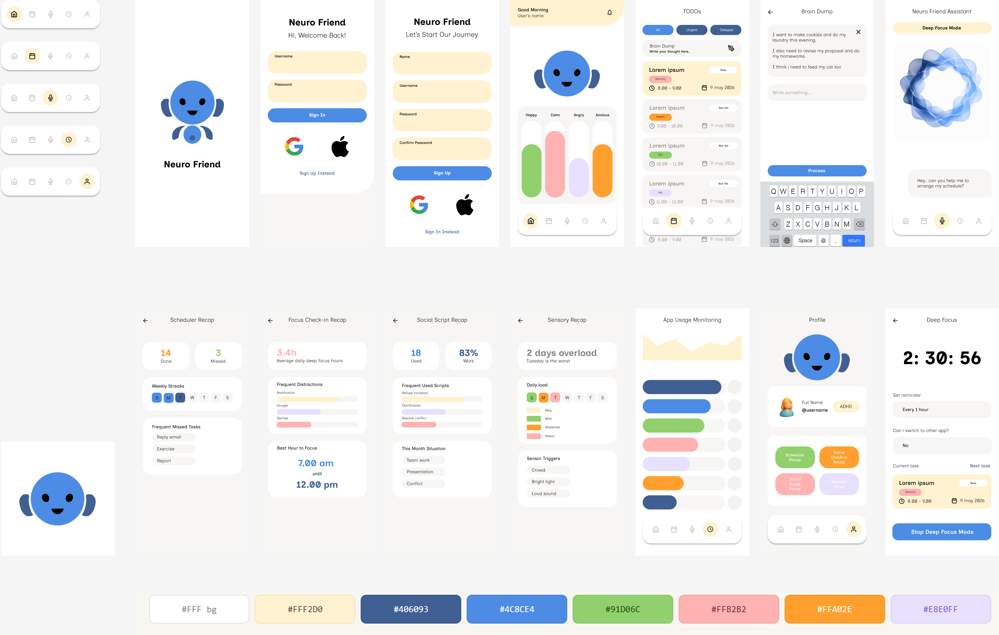

# Neuro Friend

A local-first AI companion for individuals with ADHD and Autism, built on Gemma 4, runs fully on-device, designed for Indonesian mid-range Android devices.



## Overview

Neuro Friend helps neurodivergent users navigate daily life through four core AI-powered features: focus assistance, social scripting, schedule management, and sensory overwhelm support. All inference runs on-device via Google AI Edge LiteRT with no internet required for core functionality.

## Features

- **Focus Check-in** helps users start and maintain tasks with concrete, non-judgmental first-step prompts
- **Brain Dump** accepts free-text input and parses it via Gemma 4 into structured tasks with time estimates
- **Schedule Manager** provides a visual timeline with ADHD-aware reminders and automatic buffer time
- **Social Script Helper** generates ready-to-send scripts for difficult social situations
- **Sensory Help** includes breathing guide, white/brown noise, haptic grounding, and reduce-stimulation mode
- **Overwhelm Panic Button** is a one-tap calming screen with pre-written grounding text (0ms, no LLM needed)
- **Deep Focus Mode** monitors app usage and sends voice or notification warnings when switching away (Android only)
- **App Usage Monitoring** surfaces weekly pattern insights for focus and distraction tracking
- **Mood Check-in** logs daily energy and emotion to personalize AI responses throughout the day

## Tech Stack

| Layer | Technology |
|---|---|
| UI | Flutter |
| On-device AI | Gemma 4 E2B / E4B int4 via Google AI Edge LiteRT |
| Speech | ML Kit Speech-to-Text |
| Voice output | flutter_tts |
| Local storage | Hive |
| Cloud fallback | Groq API (RAM < 2GB + internet) |

## Getting Started

```bash
git clone https://github.com/rachelmathilda/neuro-friend
cd neuro-friend
flutter pub get
flutter run
```

On first launch, the app will prompt to download the Gemma 4 model (~1.2GB). Deep Focus mode requires `PACKAGE_USAGE_STATS` permission on Android.

## References

- [Gemma 4 on Kaggle](https://www.kaggle.com/models/google/gemma-4)
- [Google AI Edge LiteRT](https://ai.google.dev/edge/mediapipe/solutions/genai/llm_inference/android)
- [MediaPipe LLM Inference](https://github.com/google-ai-edge/mediapipe-samples/tree/main/examples/llm_inference/android)
- [AI Edge Torch](https://github.com/google-ai-edge/ai-edge-torch)
- [Groq API](https://console.groq.com/docs/openai)

## License

MIT
